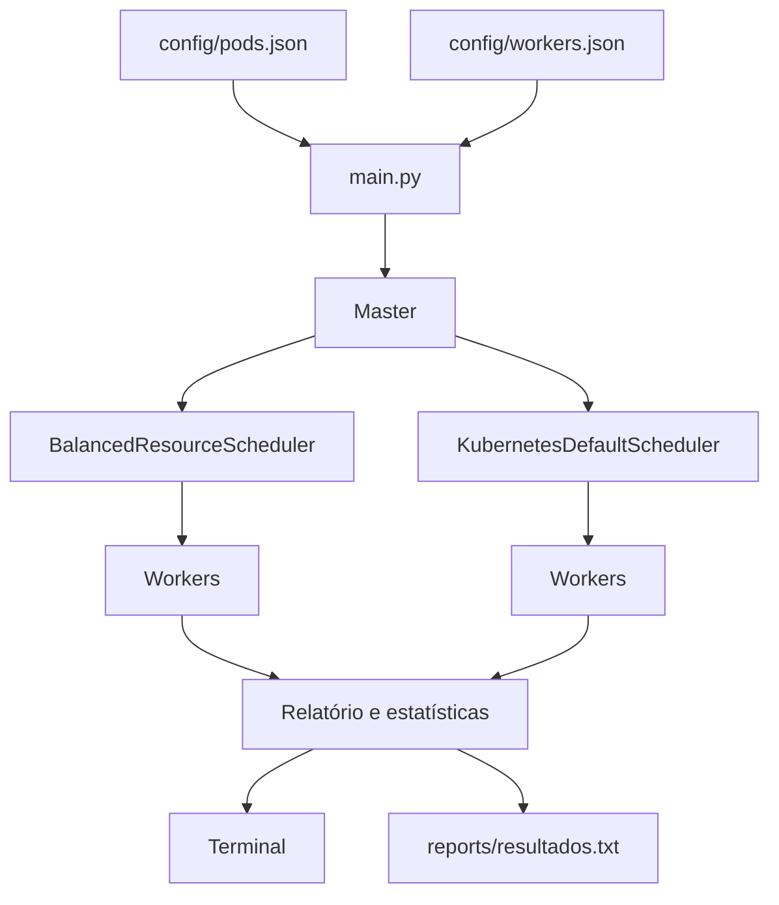
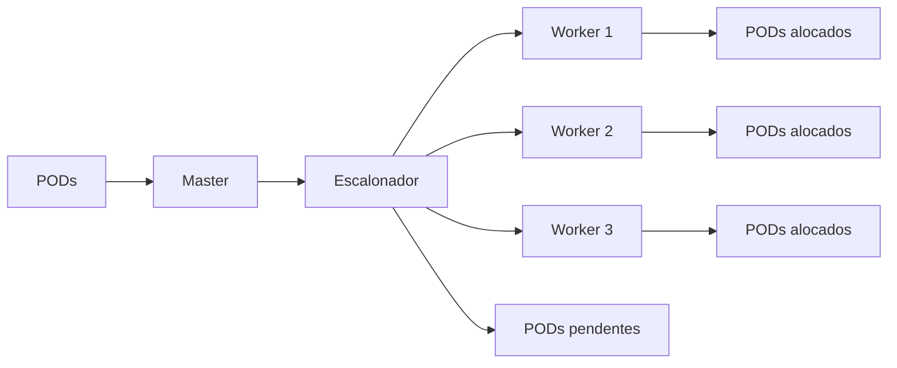
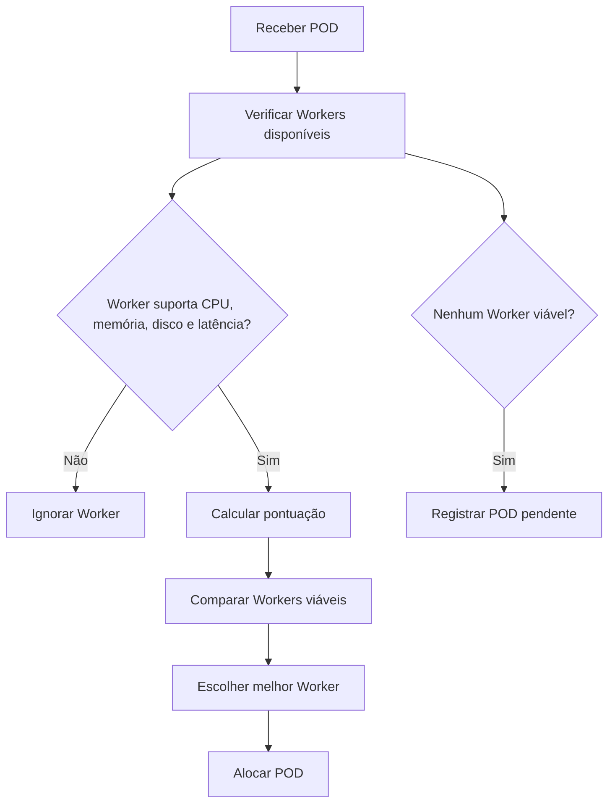

# Kubernetes Scheduler Simulator

Simulação em Python de um escalonador de PODs inspirado no funcionamento do Kubernetes.

Este projeto foi desenvolvido para a disciplina de Laboratório de Sistemas Operacionais. A proposta é representar, de forma simplificada e controlada, como um nodo Master pode distribuir PODs entre diferentes Workers a partir de métricas de alocação.

A implementação foi feita em simulação, com execução local pelo terminal Linux. Essa escolha permite focar na lógica do escalonador, na estrutura dos nodos, no uso dos recursos e na comparação entre estratégias de alocação.

---

## Visão geral

O sistema simula um ambiente com:

| Elemento | Quantidade / uso |
|---|---:|
| Master | 1 |
| Workers | 3 |
| PODs | 15 |
| Métricas de alocação | 4 |
| Algoritmos comparados | 2 |
| Relatório automático | Sim |
| Testes automatizados | Sim |

A comparação principal é feita entre:

| Escalonador | Métricas consideradas |
|---|---|
| `BalancedResourceScheduler` | CPU, memória, disco e latência |
| `KubernetesDefaultScheduler` | CPU e memória |

O objetivo não é apenas alocar o maior número possível de PODs, mas observar a qualidade da decisão de escalonamento. Em alguns casos, alocar mais PODs pode gerar violações de disco ou latência.

---

## Arquitetura da simulação



O `main.py` carrega os arquivos de configuração, cria os objetos da simulação, executa os dois escalonadores e gera os resultados no terminal e em arquivo.

---

## Técnica escolhida

A técnica escolhida foi uma simulação **single-thread** com programação orientada a objetos.

Essa decisão foi tomada para manter a execução mais clara, previsível e fácil de demonstrar. Como o foco do trabalho está no algoritmo de escalonamento e na análise dos recursos dos Workers, a abordagem single-thread facilita acompanhar cada decisão tomada pelo Master.

O projeto não utiliza multithreading nem produtor-consumidor porque a proposta principal não é simular concorrência entre processos. O foco está em representar o processo de escalonamento, comparar estratégias e visualizar os impactos das métricas na alocação dos PODs.

---

## Modelo conceitual



O Master é responsável por coordenar o processo. Ele recebe a lista de PODs, ordena por prioridade e chama o algoritmo de escalonamento. O escalonador avalia os Workers disponíveis e decide se o POD será alocado ou ficará pendente.

---

## Métricas de alocação

O escalonador proposto utiliza quatro métricas:

| Métrica | Como é usada |
|---|---|
| CPU | Verifica se o Worker possui processamento disponível |
| Memória | Verifica se existe memória suficiente para o POD |
| Disco | Evita alocações acima da capacidade de armazenamento |
| Latência | Evita Workers com latência maior que o limite aceito pelo POD |

A simulação do escalonador padrão do Kubernetes considera apenas:

| Métrica | Como é usada |
|---|---|
| CPU | Verifica capacidade de processamento |
| Memória | Verifica capacidade de memória |

Com isso, o projeto mostra que um Worker pode parecer adequado quando se observa apenas CPU e memória, mas ainda assim ser inadequado quando disco e latência entram na análise.

---

## Estrutura dos dados

### Worker

Cada Worker possui capacidades computacionais próprias:

```text
nome
CPU total
memória total
disco total
latência
CPU usada
memória usada
disco usado
PODs alocados
violações registradas
```

### POD

Cada POD possui requisitos diferentes:

```text
nome
CPU necessária
memória necessária
disco necessário
latência máxima aceita
perfil de carga
prioridade
Worker alocado
```

Os perfis de carga ajudam o escalonador proposto a ponderar melhor as métricas. Um POD de armazenamento, por exemplo, dá mais peso ao disco. Um POD sensível à rede dá mais peso à latência.

---

## Perfis de POD

O projeto utiliza diferentes perfis para representar tipos variados de aplicação:

| Perfil | Característica principal |
|---|---|
| `light` | Baixo consumo geral |
| `balanced` | Uso equilibrado de recursos |
| `cpu` | Maior dependência de processamento |
| `memory` | Maior dependência de memória |
| `storage` | Maior dependência de disco |
| `latency` | Maior sensibilidade à latência |

Esses perfis influenciam a pontuação calculada pelo escalonador proposto.

---

## Algoritmos implementados

### BalancedResourceScheduler

É o escalonador proposto no projeto.

Ele avalia os Workers disponíveis considerando CPU, memória, disco, latência e perfil do POD. O algoritmo não escolhe simplesmente o primeiro Worker livre. Ele calcula uma pontuação e seleciona o Worker mais adequado dentro das restrições definidas.

Fluxo simplificado:



A pontuação segue a ideia:

```text
score =
    peso_cpu      * cpu_livre
  + peso_memoria  * memoria_livre
  + peso_disco    * disco_livre
  + peso_latencia * score_latencia
```

A latência é tratada de forma inversa: quanto menor a latência do Worker em relação ao limite aceito pelo POD, melhor a pontuação.

---

### KubernetesDefaultScheduler

Representa uma versão simplificada do escalonador padrão do Kubernetes dentro da simulação.

Ele considera apenas CPU e memória no momento da decisão. As métricas de disco e latência são ignoradas durante a alocação.

Essa comparação é importante porque permite observar que uma decisão baseada apenas em CPU e memória pode gerar alocações aparentemente válidas, mas problemáticas para outras métricas do sistema.

---

## Resultado da execução

Na configuração atual, o projeto processa 15 PODs em 3 Workers.

| Escalonador | PODs alocados | PODs pendentes | Taxa de alocação | Violações |
|---|---:|---:|---:|---:|
| Escalonador proposto | 10 | 5 | 66.67% | 0 |
| Escalonador padrão do Kubernetes | 11 | 4 | 73.33% | 5 |

O escalonador padrão alocou mais PODs, mas gerou violações de disco e latência.

O escalonador proposto foi mais restritivo, porém respeitou todas as métricas adicionais. Essa diferença mostra que a melhor decisão de escalonamento não é necessariamente aquela que aloca mais PODs, mas aquela que respeita melhor os limites dos Workers e os requisitos das aplicações.

---

## Exemplo de saída

Trecho resumido da execução:

```text
SIMULAÇÃO COM ESCALONADOR PROPOSTO
Total de PODs processados: 15
PODs alocados: 10
PODs pendentes: 5
Taxa de alocação: 66.67%
Violações de métricas extras: nenhuma

SIMULAÇÃO COM ESCALONADOR PADRÃO DO KUBERNETES
Total de PODs processados: 15
PODs alocados: 11
PODs pendentes: 4
Taxa de alocação: 73.33%
Violações de métricas extras: 5
```

---

## Estrutura do projeto

```text
kubernetes-scheduler-simulator/
│
├── main.py
├── README.md
├── requirements.txt
├── .gitignore
│
├── config/
│   ├── pods.json
│   └── workers.json
│
├── reports/
│   └── resultados.txt
│
├── scripts/
│   └── run.sh
│
├── src/
│   ├── __init__.py
│   ├── master.py
│   ├── metrics.py
│   ├── pod.py
│   ├── report.py
│   ├── scheduler.py
│   └── worker.py
│
└── tests/
    └── test_scheduler.py
```

---

## Principais arquivos

| Arquivo | Função |
|---|---|
| `main.py` | Executa a simulação, compara os escalonadores e gera o relatório |
| `config/pods.json` | Define os PODs, seus requisitos, perfis e prioridades |
| `config/workers.json` | Define os Workers e suas capacidades computacionais |
| `src/pod.py` | Implementa a estrutura dos PODs |
| `src/worker.py` | Implementa os Workers e controla seus recursos |
| `src/master.py` | Implementa o nodo Master |
| `src/scheduler.py` | Contém os algoritmos de escalonamento |
| `src/metrics.py` | Exibe métricas e status no terminal |
| `src/report.py` | Gera o relatório em arquivo |
| `reports/resultados.txt` | Armazena o resultado da última simulação |
| `scripts/run.sh` | Script de execução pelo terminal |
| `tests/test_scheduler.py` | Testes automatizados |

---

## Como executar

Clone o repositório:

```bash
git clone https://github.com/Lenzeira/kubernetes-scheduler-simulator.git
```

Entre na pasta do projeto:

```bash
cd kubernetes-scheduler-simulator
```

Crie o ambiente virtual:

```bash
python3 -m venv .venv
```

Ative o ambiente virtual:

```bash
source .venv/bin/activate
```

Instale as dependências:

```bash
pip install -r requirements.txt
```

Execute a simulação:

```bash
python3 main.py
```

Também é possível executar pelo script:

```bash
bash scripts/run.sh
```

---

## Testes

Para executar os testes automatizados:

```bash
PYTHONPATH=. pytest
```

Resultado esperado:

```text
6 passed
```

Os testes cobrem:

| Teste | O que verifica |
|---|---|
| Alocação com todas as métricas | Confirma que um POD válido pode ser alocado |
| Disco insuficiente | Confirma rejeição quando não há espaço em disco |
| Latência alta | Confirma rejeição quando a latência passa do limite |
| Escalonador proposto | Confirma seleção de Worker viável |
| Escalonador padrão | Confirma que disco e latência são ignorados |
| POD pendente | Confirma registro de PODs não alocados |

---

## Relatório

A cada execução, o sistema gera automaticamente:

```text
reports/resultados.txt
```

O relatório apresenta:

```text
total de PODs processados
PODs alocados
PODs pendentes
taxa de alocação
uso de CPU, memória e disco por Worker
latência de cada Worker
PODs alocados em cada Worker
violações de métricas extras
```

Esse arquivo facilita a análise dos resultados e pode ser usado como apoio na apresentação do trabalho.

---

## Relação com os critérios do trabalho

| Critério | Atendimento no projeto |
|---|---|
| Estrutura do Master | Classe `Master` em `src/master.py` |
| Workers e capacidades | Classe `Worker` e arquivo `config/workers.json` |
| Mais de uma dezena de PODs | 15 PODs definidos em `config/pods.json` |
| Métricas de alocação | CPU, memória, disco e latência |
| Algoritmo de escalonamento | `BalancedResourceScheduler` |
| Distribuição dos PODs | Exibida no terminal e no relatório |
| Monitoramento | Uso de recursos por Worker |
| Estatísticas | Taxa de alocação, pendências e violações |
| Comparação com Kubernetes | `KubernetesDefaultScheduler` |
| Reprodutibilidade | README, script, testes e GitHub |

---

## Observações finais

Esta implementação não executa PODs reais em um cluster Kubernetes. Ela reproduz em simulação os elementos centrais pedidos no trabalho: Master, Workers, PODs, métricas de alocação, algoritmo de escalonamento, monitoramento, estatísticas e comparação com uma estratégia baseada no escalonador padrão.

A escolha por simulação permitiu concentrar a implementação na lógica do escalonador e na análise das decisões tomadas durante a alocação.
